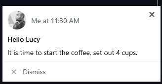
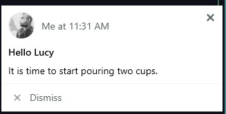
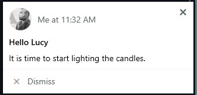
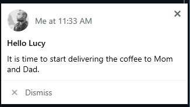
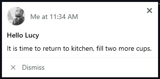
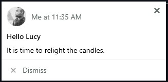
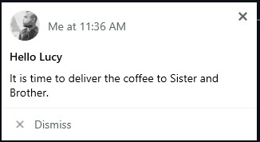
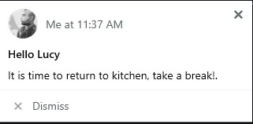

# 25-days-of-serverless

Microsoft's 25 Days of Serverless but with Google Cloud Functions

API Documentation https://us-central1-fsuptutorial.cloudfunctions.net/api/api-docs/

## Challenge One

API EndPoint: [`https://us-central1-fsuptutorial.cloudfunctions.net/api/one`](https://us-central1-fsuptutorial.cloudfunctions.net/api/one)

```json
{
  "letter": "ש"
}
```

## Challenge Two:

__Prerequisites__

1. [PushBullet](https://www.pushbullet.com) API KEY (To send push messages)
2. Firebase Blaze Plan (To use Google Cloud Pub/Sub)

#### PoC








